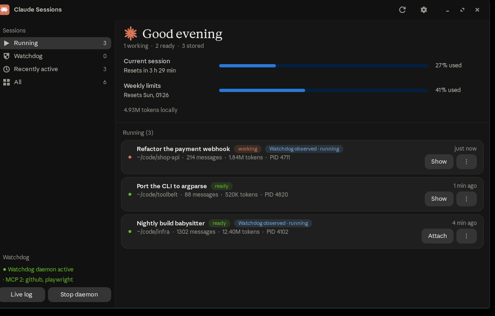

# Claude Sessions

[](https://github.com/JBGfr/claude-sessions/actions/workflows/tests.yml)

A small GTK3 desktop window that lists the Claude Code sessions on the machine
it runs on: the ones running right now, the ones stored on disk, the queue of
the [Claude Watchdog](https://github.com/JBGfr/claude-watchdog) if that is
installed, and the current plan usage. Everything it displays it reads from
local files and from the Claude Code CLI; it opens no network connection.



*The screenshot runs in demo mode (`CS_DEMO=1`), so it shows invented sessions
instead of real titles and paths — see [Screenshots](#screenshots).*

The user interface, the source comments and the commit messages are German.
This README is the English one; `README.de.md` is the German version.

## What it shows

| Section | Source | Contents |
|---|---|---|
| Running | `claude agents --json --all` | title, project directory, PID, state (busy/idle) |
| Watchdog queue | `state.db` of the watchdog, read-only | managed tasks that have no session running yet |
| Recently active | `~/.claude/projects/*/*.jsonl` | the last 40 stored sessions |

A row carries the session title, the project directory, the age of the last
activity and the token total of that session. Sessions the watchdog knows
about get a pill with its mode and status. A made-up example of what a row
looks like — the real ones carry your own titles and paths:

```
Running
  Rewrite the CSV importer      ~/code/example-app     PID 12345   busy    1.2 M tokens
  Draft the release notes       ~/code/example-docs    PID 12346   idle    310 k tokens
```

The sidebar switches between the three sections and "All" and shows how many
rows each holds. The footer shows whether the watchdog daemon is active, can
start or stop it, opens a live log, and carries a pill listing the configured
MCP servers of Claude Code and Claude Desktop. That pill says "configured",
not "connected": the app only reads the two configuration files, because
`claude mcp list` runs a health check that takes seconds. Credential-bearing
fields such as `env` or `headersHelper` are never read and never displayed.

### Plan usage

Above the list the app shows the load of the five-hour window, the reset time
and the weekly value — the same numbers `/usage` reports inside a session.

These numbers are deliberately **not** reconstructed from the transcripts.
They cannot be: Claude Desktop, claude.ai in a browser and other devices draw
on the same account without leaving a line on this machine. Instead Claude
Code hands them to the status line command under `rate_limits`.
`tools/statusline.py` writes them to
`~/.local/state/claude-sessions/usage.json`, and the app reads that file. This
runs locally and costs no tokens ([status line documentation][statusline]).

To enable it, point the `statusLine` command in `~/.claude/settings.json` at
the script:

```json
"statusLine": {
  "type": "command",
  "command": "/path/to/claude-sessions/tools/statusline.py",
  "padding": 0
}
```

The script also prints the usual status line inside every session (model,
directory, git branch, limit, reset, context fill). It runs in about 22 ms,
starts no subprocess — the branch comes straight out of `.git/HEAD` — and
swallows every error, because a status line must never disturb a session.

Without that file the header says so instead of inventing a number. The same
holds once the reset time passes while no session is open: the stored
percentage then describes a window that no longer exists, and the header says
the window was reset rather than keep claiming it. Claude Code only supplies
`rate_limits` on Pro/Max plans, and only after the first API response of a
session.

The per-row token counts come from the transcripts themselves (input + output
+ newly written cache, cache reads excluded), including the sub-agents of that
session under `<project>/<session-id>/subagents/`. Sub-agents get no row of
their own: they are helpers of one run, not sessions.

[statusline]: https://code.claude.com/docs/en/statusline

## Requirements

- Linux with an X11 desktop session. Window focusing uses `wmctrl`; the
  systemd unit checks for a display with `xdotool`.
- Python 3 from the distribution. Developed and tested against 3.13, which is
  also what CI runs; older versions are untested.
- PyGObject and GTK 3, installed **from the distribution packages** — on
  Debian, Ubuntu and Kali that is `python3-gi`, `python3-gi-cairo` and
  `gir1.2-gtk-3.0`. There is no pip package, no virtualenv and no third-party
  dependency; the app imports the standard library plus `gi`.
- `systemd --user`. Windows opened from the app are placed in their own
  transient unit, and the app itself can run as a user service.
- The Claude Code CLI. The app calls `claude agents --json --all`; it looks
  for the binary at `~/.local/bin/claude` and otherwise takes what `PATH`
  provides.
- A terminal emulator. `claude-session-open` opens the resumed session in the
  first one it finds in `PATH`: `qterminal`, `x-terminal-emulator`,
  `xfce4-terminal`, `konsole`, `xterm`. On Debian and Ubuntu those are also the
  package names, except `x-terminal-emulator`, which is the alternatives link
  to whichever terminal is installed. The log windows and **Attach** open in
  `qterminal` specifically.
- Optional: `dtach` (Debian/Ubuntu: `apt install dtach`), for the long-running
  sessions below. Without it everything else keeps working; only
  `claude-sessionctl` refuses to start or attach one, and says why.
- Optional: the [Claude Watchdog](https://github.com/JBGfr/claude-watchdog).
  Without it the watchdog section stays empty and the footer says the daemon
  is inactive — that is not an error.

Two of the per-row actions and the whole long-running-session feature are not
done by the window itself but by helper commands, and those ship **with** this
repository — see [Helper commands](#helper-commands) below. The one outside
program still assumed by name is `qterminal`. Where a helper or that terminal
is missing, that single action reports a failure in the status bar; the
overview itself keeps working.

## Helper commands

Three command line tools in `bin/` do the work that needs a terminal or a
service of its own. They are ordinary programs: you can run them without the
overview ever being open, and they print their own messages instead of going
through the window. `install-desktop.sh` links all three into `~/.local/bin`.

### `claude-session-open` — reopen a stored session

```sh
claude-session-open 11111111
claude-session-open claude-session://11111111-2222-3333-4444-555555555555
```

This is what **Open** does on a stored row. It looks the session up under
`~/.claude/projects`, opens a terminal window and runs `claude --resume` in it.
The id may be abbreviated as long as it stays unique — the eight characters the
overview shows are enough. The URI form is what a desktop handler passes in.

The working directory comes out of the transcript, not out of the directory
name: Claude builds that name by replacing every character of the path that is
not a letter or a digit with `-`, and that cannot be reversed. It matters,
because `claude --resume` finds a session only from the directory it belongs
to. If that directory no longer exists, the command says exactly that instead
of starting in the home directory and failing obscurely.

The terminal is the first of `qterminal`, `x-terminal-emulator`,
`xfce4-terminal`, `konsole` and `xterm` that `PATH` provides — a preference,
not a requirement. If none of them is there, nothing happens silently: the
command exits non-zero and lists every name it looked for, so it is clear which
package to install, or under which name to put your own terminal into `PATH`.

Messages are appended to `~/.local/state/claude-sessions/events.log`, and on a
desktop with a notification daemon a failure also appears as a pop-up. That log
is the reason the command can be started by a click at all: a program launched
from an icon has nowhere else to leave a message. Exit codes are `2` for a
wrong or missing session id, `1` for a broken environment (no terminal, no
`claude`), `0` when a window was opened.

### `claude-sessionctl` — sessions that outlive their terminal

An ordinary Claude Code session dies with the terminal it runs in: close the
window, log out or reboot, and it is gone. `claude-sessionctl` runs a session
as a **systemd user service** instead, with its terminal held open by `dtach`.
Most of the time nobody is attached to it. You connect when you want to look
and detach again with `Ctrl+\`; the session keeps running. Since `start`
enables the service as well, it also comes back whenever the user manager
starts again — at your next login, or already at boot if lingering is on.

```sh
claude-sessionctl new mytool ~/code/mytool   # create a project and start it
claude-sessionctl status                     # read-only overview of all of them
claude-sessionctl attach mytool              # connect to the live terminal
claude-sessionctl log mytool -f              # follow its log
claude-sessionctl stop mytool                # stop it and take it out of autostart
```

`new` writes `~/.config/claude-sessions/<name>.conf` — working directory,
model, effort, a first prompt, extra arguments — and starts
`claude-session@<name>.service`. Every subcommand except `new`, `start`,
`stop`, `restart` and `rm` only reads; `rm` keeps the logs. Missing
prerequisites are named before anything is touched: without `dtach` or without
a systemd user instance the command exits 127 and says which one is missing,
rather than leaving behind a service that fails to start for reasons only the
journal knows.

These are the sessions the overview offers **Attach** for instead of **Show**:
they have no window of their own, so there is nothing to raise — the button
opens a terminal that attaches to the running session. Stopping one from the
`⋮` menu goes through `claude-sessionctl stop` for a related reason: a plain
`SIGTERM` would only have systemd restart the session ten seconds later.

Two more files sit behind this, and neither is meant to be called by hand:
`bin/claude-session-runner` is the `ExecStart=` of the unit, and
`systemd/claude-session@.service` is the template it is started from. The unit
gives each session a memory ceiling, restarts it when it crashes but **not**
when it exits cleanly, and after five failed starts in ten minutes it stays
down instead of looping. The reasoning for each of those decisions — and what
it cost to find out — is written into the files themselves.

## Installation

```sh
git clone https://github.com/JBGfr/claude-sessions.git
cd claude-sessions
./tools/install-desktop.sh
```

The installer works purely additively: it deletes nothing, calls no
`systemctl enable`, starts nothing, and prints a line before it replaces an
existing file whose content actually changes — a second run over an unchanged
installation reports no replacements. It needs no `sudo` and writes only inside
the home directory. It derives the repository path from its own location, so
the clone may live wherever you want it; a path containing spaces works, for
the clone and for the home directory alike.

It sets up:

- hicolor icons in `$XDG_DATA_HOME/icons/hicolor/*/apps/`,
- `~/.local/bin/claude-sessions` as a symlink to `bin/claude-sessions`,
- a menu entry in `$XDG_DATA_HOME/applications/` and, if there is a desktop
  folder, a desktop launcher (marked as trusted for XFCE),
- `$XDG_CONFIG_HOME/systemd/user/claude-sessions-app.service` as a symlink to
  the unit in the repository,
- `~/.local/bin/claude-session-open`, `~/.local/bin/claude-sessionctl` and
  `~/.local/bin/claude-session-runner` as symlinks to the three helpers in
  `bin/` — without those names in `PATH`, **Open** and **Attach** do nothing
  and the unit template cannot find its runner,
- `$XDG_CONFIG_HOME/systemd/user/claude-session@.service` as a symlink to the
  unit template. It is only put there: never started, never enabled. A template
  cannot be started without an instance name anyway, and the instances are
  created by `claude-sessionctl new`.

Those last four links are the one place where the installer refuses to
overwrite. If such a name already points somewhere else, it reports the link
and leaves it alone, because it may come from an older or a different
installation whose services are running right now. Remove the link yourself and
run the installer again to switch it over. If `dtach` is missing, the installer
says so at the end; it installs nothing on your behalf.

`$XDG_DATA_HOME` and `$XDG_CONFIG_HOME` default to `~/.local/share` and
`~/.config`; a value that is not an absolute path is ignored, as the
specification requires. `~/.local/bin` has no such variable.

Steps whose helper program is missing (`gio`, `sha256sum`, `gtk-update-icon-cache`,
`update-desktop-database`, `systemctl`, `xdg-user-dir`) are
skipped with a note; the installation still counts as successful. The same
goes for a helper that is present but cannot do the job — without a session
bus, for instance, `gio` cannot store the XFCE trust flag, and the installer
says so instead of leaving an unmarked icon behind.

Running it without installing anything works as well:

```sh
bin/claude-sessions
```

`bin/claude-sessions` is a plain `/bin/sh` wrapper: it resolves its own
location through the symlink chain, sets `PYTHONPATH` to the repository and
starts `python3 -m claude_sessions.app`.

## Using it

- **Show** (running session): brings the session's terminal window to the
  front. It walks the process parent chain and activates the first window a
  window manager knows about — `wmctrl`, not `xdotool search --onlyvisible`,
  which misses windows on other workspaces.
- **Attach** (running under a session service): opens a terminal attached to
  that service, since such sessions have no window of their own.
- **Open** (stored session): resumes the session in a new terminal window.
- **⋮**: watchdog attach/pause/resume/remove, show watchdog logs, open the
  project folder, copy the session ID, terminate the process (SIGTERM, with a
  confirmation dialog).
- Footer: start or stop the watchdog daemon, open the live log.

Titles are the `aiTitle` recorded in the transcript; where there is none, the
first hand-typed prompt of the session is used instead.

The list refreshes every 6 seconds in a background thread, and only while a
window is actually visible — if it is closed, minimised or on another
workspace, nothing is loaded at all. Transcripts are re-read only when they
changed (cache keyed by mtime and size), and usage data is parsed only for the
bytes that were appended. Measured cost on the development machine: 0.33 % of
one CPU, 233 ms for the first scan across 102 files, about 1 ms afterwards.

## Running it as a service of the desktop session

`install-desktop.sh` also installs `claude-sessions-app.service`. It exists
for clean logging and a cgroup of its own — **not** to make the window appear
by itself.

```sh
systemctl --user start claude-sessions-app     # open it now
systemctl --user stop  claude-sessions-app     # close it
journalctl --user -u claude-sessions-app -f    # follow the log
```

The overview opens **only on request**: desktop icon, menu entry or
`systemctl start`. That is why the unit has no autostart, no `Restart=` and no
`[Install]` section — it cannot even be `enable`d, and a crash brings no
window back. A window that opens on its own is explicitly not wanted.

Three details are load-bearing:

- `ExecCondition` asks `xdotool getdisplaygeometry` whether there is a display
  at all. Without one the service counts as skipped rather than failed. If
  `xdotool` itself is missing, the check passes rather than blocking the
  start.
- `KillMode=process` stops only the app. Otherwise every stop would drag down
  the terminals opened from the overview.
- The launcher calls `bin/claude-sessions --service`, so that there is exactly
  one way in. If the icon started the app past the service, a later
  `systemctl start` would report "Started" and immediately "Deactivated
  successfully" while the window sits open, because the app is a
  `Gtk.Application` with a fixed ID.

Windows opened from the app (terminal, folder, logs) run in their own
transient unit via `systemd-run --user --collect --property=ExitType=cgroup`,
with memory limits. `start_new_session=True` alone is not enough: it detaches
from the process group, not from the cgroup, and without `ExitType=cgroup`
systemd tears the freshly opened window down again as soon as the starter
exits.

## Data sources

Everything is local, and everything except the watchdog CLI is read-only.

| What | Where | Access |
|---|---|---|
| Stored sessions, titles, token counts | `~/.claude/projects/*/*.jsonl` | opened `"rb"`, read only |
| Running sessions | `claude agents --json --all` | subprocess, output captured |
| Watchdog tasks and restarts | `<watchdog dir>/state.db` | SQLite URI `mode=ro` |
| Watchdog daemon state | `systemctl --user is-active claude-watchdog` | subprocess, output captured |
| Plan usage | `~/.local/state/claude-sessions/usage.json` | read only |
| MCP servers | `~/.claude.json`, `~/.config/Claude/claude_desktop_config.json` | read only |

The watchdog database is **only ever opened read-only** — the connection uses
the SQLite URI `file:<path>?mode=ro`. Every change to watchdog state goes
through the watchdog's own CLI instead, so that this app never has to reason
about the other program's schema or locking. Details and file:line references
are in [SECURITY.md](SECURITY.md).

## Configuration

### Settings

The gear button in the header bar opens **Settings**:

| Setting | What it does | Default |
|---|---|---|
| Language | `Automatic (system)`, `English`, `Deutsch`. Automatic follows `$LC_ALL` / `$LC_MESSAGES` / `$LANG` (`de…` → German, anything else → English) | automatic |
| Show greeting | The greeting line with the sunburst. Off means the row is not built at all, not an empty gap | on |
| Name in the greeting | “Good evening, Ada”. Empty greets without a name | empty |
| Refresh every … seconds | 2–60 | 6 |
| Rows under “Recently active” | 5–500 | 40 |
| Notify on watchdog events | Desktop pop-ups of the **watchdog** daemon | on |
| Notifications per hour | Ceiling for those pop-ups, 0 = unlimited | 0 |

The values live in `~/.config/claude-sessions/settings.json`
(`$XDG_CONFIG_HOME` is honoured; `CS_SETTINGS_PATH` moves the whole file —
that is what the tests use). Reading it can never fail: a missing, broken or
foreign file falls back to the defaults, numbers outside the range are
clamped, and unknown keys are dropped. Writing goes through a temporary file
in the same directory plus `os.replace()`, so an interrupted save leaves
either the old or the new file, never half of one.

The window reads the file **once at start**. Language, refresh interval and
row count therefore take effect after a restart — the dialog says so, and
`Apply & restart` does it for you (`systemctl --user restart
claude-sessions-app`, started detached so it survives stopping the app).

The name for the greeting is looked up as: `settings.json` →
`$CS_GREET_NAME` → nothing.

### Pop-ups go to the watchdog

The two pop-up settings do not act in this app at all — they belong to the
[watchdog](https://github.com/JBGfr/claude-watchdog) daemon, which reads
`CW_NOTIFY` and `CW_NOTIFY_MAX_PER_HOUR` from its environment. Saving
therefore writes a drop-in next to that unit:

```ini
# ~/.config/systemd/user/claude-watchdog.service.d/uebersteuerung.conf
[Service]
Environment=CW_NOTIFY=1
Environment=CW_NOTIFY_MAX_PER_HOUR=0
```

followed by `systemctl --user daemon-reload` and `try-restart`. Three
deliberate details: the file is only written when its content actually
changes (otherwise saving an unrelated setting would interrupt a running
watchdog), `try-restart` never *starts* a daemon that is stopped, and if the
watchdog unit does not exist the whole step is skipped in silence — the
overview works without a watchdog. `CS_WD_DROPIN_PATH` moves the drop-in
(again: tests).

### Watchdog directory

**Watchdog directory.** By default the app looks in `~/.claude-watchdog` for
`state.db` and `bin/claude-watchdog`. The environment variable
`CS_WATCHDOG_DIR` moves both:

```sh
CS_WATCHDOG_DIR=~/somewhere/claude-watchdog bin/claude-sessions
```

An empty value counts as unset, `~` is expanded, and the variable is read once
at import time. If the directory does not exist, that is not an error: the
watchdog section stays empty and the footer notes that `state.db` is not
readable.

For the service, add the variable through a drop-in
(`systemctl --user edit claude-sessions-app.service`):

```ini
[Service]
Environment=CS_WATCHDOG_DIR=%h/somewhere/claude-watchdog
```

**Refresh cadence.** `REFRESH_SECONDS` and `MAX_STORED_ROWS` at the top of
`claude_sessions/app.py` are the fallbacks behind the two settings above:
they apply as long as `settings.json` says nothing else. `IDLE_POLL_SECONDS =
2` — the "is the window visible again" check while it is not — is not
configurable and stays in the source. Faster than 6 seconds is measurably
expensive: at 3 seconds the permanent load was about 9 % of one CPU with
nobody watching, which is why the dialog stops at 2.

## Appearance

The palette and the measurements — colours, spacing, font sizes — are taken
from the Claude desktop app. Its fonts are not: "Anthropic Sans" and
"Anthropic Serif" are part of that application and are **not** shipped with
this repository, for licensing reasons. The CSS names them first and then
falls back: `"Anthropic Sans", Inter, "Noto Sans", Cantarell, sans-serif` for
the interface, `"Anthropic Serif", Georgia, serif` for the greeting. Whoever
has those fonts installed sees the same typography as the original; everyone
else sees the same colours and the same grid, set in the system font.

## Screenshots

The window shows session titles and project paths, so a screenshot of a real
run publishes exactly those. Every picture in this repository therefore comes
from demo mode, which replaces the snapshot with invented sessions:

```sh
CS_DEMO=1 bin/claude-sessions
```

The data lives in `claude_sessions/demo.py`; `tests/test_demo.py` keeps it
honest — the counters have to match the list, no `/home/` path may appear, and
two runs have to produce the same picture. Never commit a screenshot taken
from a real session.

## What it puts on screen

The window shows session titles and project paths. A title is whatever the
session was about, and a path is a directory on the machine. Anyone who shares
a screenshot of this app shares those titles and paths. See
[SECURITY.md](SECURITY.md).

## Development

```sh
python3 -m unittest discover -s tests -q   # tests: no GTK, no network, no real subprocesses
python3 tools/make_icons.py                # regenerate the icon assets
```

The tests import only the GTK-free modules (`data`, `actions`,
`einstellungen`, `texte`), so they run on a bare Python without PyGObject;
that is what the CI job does. `app.py` is deliberately kept thin for that
reason: text formatting belongs in `data.py`, wording in `texte.py`.
The single icon source is `assets/app-icon-master.png`; `make_icons.py` only
scales from it.

## License

MIT — see [LICENSE](LICENSE).

Not affiliated with Anthropic. Claude and Claude Code are products of
Anthropic; this is an independent tool.
